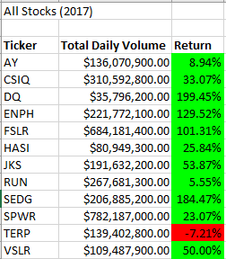
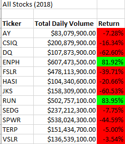
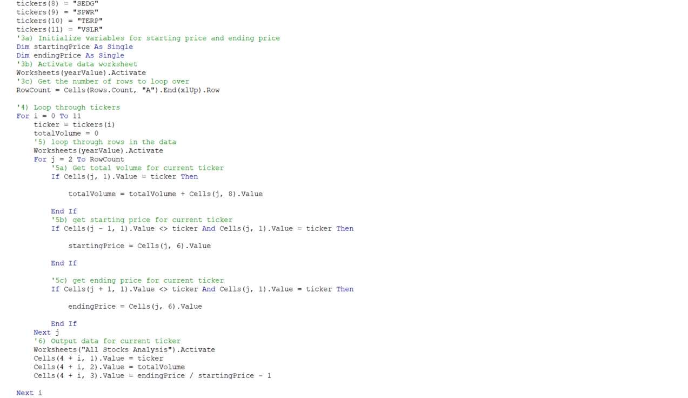

# VBA stock-analysis

## Purpose

The original workbook that we created for Steve works well with a small sample size of stocks. While it could work on a data set with thousands of stock it could take a long time to execute. In this challenge we will refactor the Module 2 solution to loop through all the data at once. With the findings we can determine if refactoring the data made it excute quicker.

## Results

From the results, the name of the stock, daily volume that pertains to each stock and the return percentage are our columns in which we will be ouputting data. Also the "Return" column is formated in green for a positve return and red for a negative return.

__2017__ & __2018__

 

From the results, we can see all the stocks had a positive return in the Yeay 2017 except for TERP. The format on column "Return" makes the data readable and easier to anaylize. One clear difference when comparing the results are the returns in 2018. Only 2 from 2017 had positive returns, which were ENPH and RUN. While TERP still had a negative return in 2018 it actualy had a false positive return as it increased by %2.2.

### VBA  Code

__Module 2 Code__

