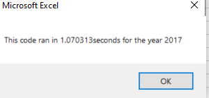
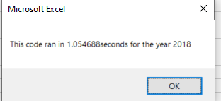
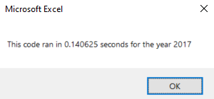
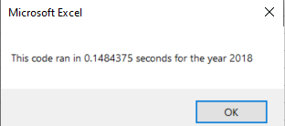

# VBA stock-analysis

## Purpose

The original workbook that we created for Steve works well with a small sample size of stocks. While it could work on a data set with thousands of stock it could take a long time to execute. In this challenge we will refactor the Module 2 solution to loop through all the data at once. With the findings we can determine if refactoring the data made it excute quicker.

## Results

From the results, the name of the stock, daily volume that pertains to each stock and the return percentage are our columns in which we will be ouputting data. Also the "Return" column is formated in green for a positve return and red for a negative return.

__2017__ & __2018__

 

From the results, we can see all the stocks had a positive return in the Yeay 2017 except for TERP. The format on column "Return" makes the data readable and easier to anaylize. One clear difference when comparing the results are the returns in 2018. Only 2 from 2017 had positive returns, which were ENPH and RUN. While TERP still had a negative return in 2018 it actualy had a false positive return as it increased by %2.2.

### VBA  Code

__Module 2 Code__

In the original code that we went through in the Module we looped through the tickers. 
`For i = 0 To 11 ticker = tickers(i)`

Even though its 0 to 11 it iterates 12 times as `0` is the first iteration. Then within the loop we had another loop to iterates on the rows. The loop for the rows started at 2 and ended at RowCount. Within our code, thanks to google, we defined RowCount as the number of rows counted within this data set. 

My excel sheet ran it extremely slow as seen below :

Even though 2018 sheet had the same amount of rows, code ran a little bit faster for 2018 stocks :

__Refactor Code__

While the refactor code was similar to the original. Getting rid of the nested for loops and creating a `for` loop to initialize the tickerVolumes and then to loop over all the rows in the spreadsheet made it quicker. 

As seen below our results were almost cut by a whole second. :

 

## Summary

### Pros of Refactoring Code 

Improves the Design (Makes the code clean and organized)
Helps programing faster
In this case it used less memory.

### Cons of Refactoring Code

For me it was time consuming,

Could be difficult to maintain with a larger data set.

If it weren't for the module then refactoring on a different data set would have been difficult. 

In the case of this original VBA code, it greatly improved the speed of the function. While writing VBA if it works, it works but other people that only want to see results will just want to see the results and quick. 
